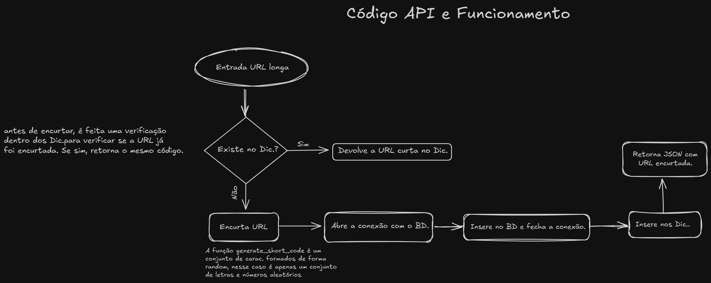
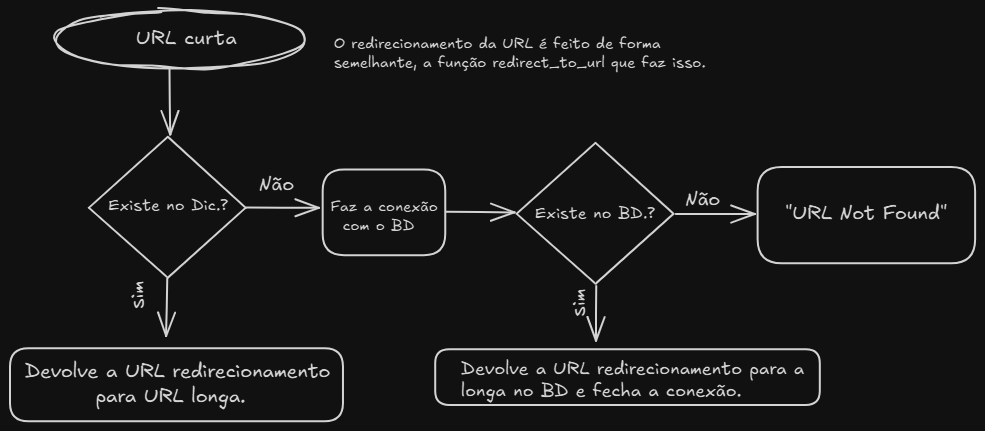
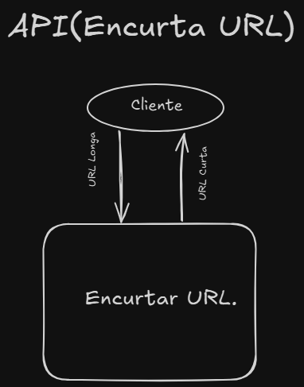

# 🔗 API Encurtador de URL

## 📌 Introdução

Esta API permite encurtar URLs longas e redirecionar usuários para as URLs originais através de um código curto gerado automaticamente.  
A aplicação é construída com **Flask** e utiliza um banco de dados **PostgreSQL** hospedado na AWS para armazenar os dados das URLs encurtadas.

## 🛠 Tecnologias Utilizadas

- 🐍 Python 3.13.1  
- 🌐 Flask (servidor web)  
- 🗄 MySQL (banco de dados, hospedado na AWS)

---

## 🔀 Endpoints

Os endpoints são os pontos de acesso da API, definidos por combinações de URL e métodos HTTP.

### ✅ GET `/`

**Descrição:**  
Verifica o status da API. Se o servidor estiver funcionando corretamente, retorna uma mensagem de confirmação.  

**Exemplo de resposta:**
```json
{
  "message": "Servidor ativo!"
}
```

---

### 🔧 POST `/shorten`

**Descrição:**  
Recebe uma URL longa e retorna sua versão encurtada.

**Requisição:**
```json
{
  "url": "https://www.exemplo.com/pagina-completa"
}
```

**Resposta:**
```json
{
  "short_url": "http://dominio.com/abc123"
}
```

---

## 🗂 Estrutura dos Dados

### 📌 Estrutura em memória (dicionários):
- `short_to_full`: Mapeia códigos curtos para URLs longas.  
- `full_to_short`: Mapeia URLs longas para seus respectivos códigos curtos.

### 💾 Estrutura no banco de dados (tabela `UrlEncurtador`):
| Campo         | Descrição                       |
|---------------|---------------------------------|
| `url_full`     | Armazena a URL longa original  |
| `url_encurtada`| Armazena a URL curta gerada    |

---

## ⚙️ Funcionamento Interno

A API conta com três funções principais:

### `generate_short_code()`
- Gera uma sequência aleatória de caracteres que servirá como código da URL encurtada.

### `shorten(url)`
- Recebe uma URL longa e verifica se ela já foi encurtada.
- Se já existir, retorna a versão curta existente.
- Caso contrário, gera um novo código, salva nos dicionários e no banco de dados, e retorna a nova URL encurtada.

### `redirect_to_url(code)`
- Recebe o código curto e procura pela URL longa correspondente:
  - Primeiro nos dicionários em memória.
  - Depois no banco de dados, caso não encontre.
- Se encontrada, realiza o redirecionamento para a URL original.
- Se não encontrada, retorna uma mensagem de erro.

---

## 🚀 Exemplo de Fluxo

1. Usuário envia uma URL longa via `POST /shorten`.
2. A API verifica se a URL já está encurtada.
3. Se não estiver, um código é gerado e armazenado junto com a URL.
4. Quando alguém acessa a URL encurtada (`GET /<code>`), a API redireciona para a original.


## 🖼 Diagramas e Fluxogramas

### 🔁 Funcionamento Interno da API




> Este diagrama mostra o fluxo de como a API lida com o encurtamento e redirecionamento de URLs.

---

### 🌐 Comunicação Cliente ⇄ API



> Este mostra como o cliente interage com a API: envio de URL longa e recebimento de URL curta/redirecionamento.

---